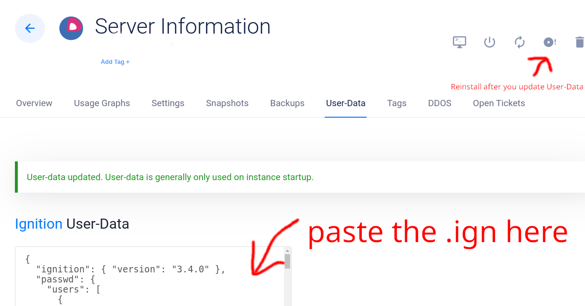

# Running Locally (EASY)

1. Clone the repository
2. Navigate to the project folder
3. Build the Podman container: ```bash deploy/build.sh```
4. Run the curation and translation job: ```bash deploy/run.sh``` which uses the following:
    - [```publisher.py```](./utils/publisher.py): Main job control loop
    - [```sources.json```](./config/sources.json): Source site configuration
    - [```browser.py```](./utils/browser.py): Extracts text from sites
    - [```finder.txt```](./config/finder.txt): Prompt for finding articles to translate
    - [```summarizer.txt```](./config/summarizer.txt): Prompt for summarizing and ranking articles
    - [```templater.py```](./utils/templater.py): Creates html and deploys to AWS S3
5. Output appears in the ```tt-debug``` Podman volume (can also push to S3 with AWS credentials) run ```bash deploy/view_logs.sh``` to view the output html.
6. Access logs in the ```tt-logs``` Podman volume run ```bash deploy/view_logs.sh``` to tail them while the job is running.

**NOTE:** You can use ```docker``` if you prefer. You should be able to take any of the ```podman``` commands and replace them with ```docker``` and it should work.

# Server Deployment (ADVANCED)

This guide explains how to deploy and configure an automated task runner using Ignition configuration (see example [server-config-nosecrets.ign](./deploy/hosted_example/server-config-nosecrets.ign)). It should work on any linux you like but it has been successfully tested on **Flatcar Container Linux** and **Fedora CoreOS**.

## Overview

This project sets up an automated task execution system that runs twice daily (9 AM and 9 PM) using systemd timers. The configuration includes:
- User setup with SSH access
- Automated task execution scripts
- System service and timer configuration
- Log viewing utilities

## Prerequisites

- A server running **Flatcar Container Linux** or **Fedora CoreOS**
- SSH key pair
- Access to server with administrative privileges

## Configuration Steps

### 1. Generate Password Hash

First, generate a password hash for the core user:

```bash
openssl passwd -6
```

### 2. Prepare SSH Key

Ensure you have an SSH key pair. If not, generate one:

```bash
ssh-keygen -t ed25519 -C "your_email@example.com"
```

Your public key is typically located at `~/.ssh/id_ed25519.pub`

### 3. Create Base64 Encoded Files

To encode your script files to base64:

```bash
base64 -w 0 your-script.sh
```

For the provided configuration, you'll need to encode:
- `tt-run.sh` (your main task script, add your API keys and encode from example found at [./deploy/hosted_example/tt-run.sh](./deploy/hosted_example/tt-run.sh))

### 4. Modify Configuration File

1. Replace the following placeholders in the Ignition configuration:
   - `PASTE_PASSWORD_HASH_HERE`: Your generated password hash
   - `PASTE_YOUR_OWN_SSH_KEY_HERE`: Your SSH public key
   - `PASTE_BASE64_OUTPUT_HERE`: Base64 encoded content of your tt-run.sh script

### 5. Deploy Configuration

Save the Ignition configuration and use it during server provisioning. We use Vultr and configure it like so:



## File Structure

The configuration creates the following files:
- `/home/bradmin/tt-run.sh`: Main task execution script
- `/home/bradmin/run-now.sh`: Script to manually trigger the task
- `/home/bradmin/view-logs.sh`: Script to view task logs
- `/etc/systemd/system/tt-run.service`: Systemd service configuration
- `/etc/systemd/system/tt-run.timer`: Timer configuration for scheduled execution

## Usage

### Viewing Logs
Execute the view-logs script:
```bash
./view-logs.sh
```

### Manual Execution
To run the task manually:
```bash
./run-now.sh
```

## Schedule

The task runs automatically:
- At 9:00 AM daily
- At 9:00 PM daily

## Security Considerations

- The configuration creates a user named 'core' with sudo privileges
- Access is restricted to SSH key authentication
- Scripts are created with appropriate permissions (mode 484 = chmod 744)
- Service runs as root user for system-level access

## Troubleshooting

Check service status:
```bash
systemctl status tt-run.service
```

View timer status:
```bash
systemctl list-timers tt-run.timer
```

View system logs:
```bash
journalctl -u tt-run.service
```


