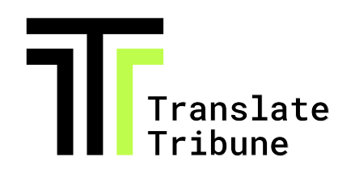

<div align="center">
    
</div>

<p align="center">
  <a href="https://translatetribune.com" target="_blank"></a>
  <a href="./RSS.md" target="_blank"></a>
  <a href="https://github.com/Inoxoft-Company/TranslateTribune-Mobile">
</a>
</p>

<h4 align="center">
    <a href="#English">
        English
    </a>|
    <a href="#Українська">
        Українська
    </a>|
    <a href="#中文">
        中文
    </a>|
    <a href="#español">
        Español
    </a>|
    <a href="#ﺎﻠﻋﺮﺒﻳﺓ">
        ﺎﻠﻋﺮﺒﻳﺓ
    </a>|
    <a href="#français">
        Français
    </a>|
    <a href="#русский">
        Русский
    </a>|
    <a href="#português">
        Português
    </a>|
    <a href="#deutsch">
        Deutsch
    </a>|
    <a href="#日本語">
        日本語
    </a>|
    <a href="#türkçe">
        Türkçe
    </a>|
    <a href="#한국어">
        한국어
    </a>|
    <a href="#italiano">
        Italiano
    </a>|
    <a href="#nederlands">
        Nederlands
    </a>|
    <a href="#فارسی">
        فارسی
    </a>|
    <a href="#svenska">
        Svenska
    </a>|
    <a href="#עברית">
        עברית
    </a>|
    <a href="#magyar">
        Magyar
    </a>|
    <a href="#kiswahili">
        Kiswahili
    </a>
</h4>

# English

A free and open-source project that leverages AI to curate, translate, and summarize foreign-language news articles from diverse countries.

## Mission 🎯

- 🚀 Overcome language barriers and media biases
- 🌈 Highlight diverse perspectives
- 🔄 Prove the potential of self-updating, self-improving projects
- ⚖️ Demonstrate the limitations of copyright in the age of AI
- 💡 Provide an alternative to expensive news subscriptions
- 🗣️ Encourage a more informed and diverse global discourse
- 🌟 Prove that privacy-protecting free and open source projects can thrive

## Features ✨

- 📅 Daily updates by 6am Eastern
- 🌍 Diverse sources from various countries and perspectives (see [sources.json](./config/sources.json) and [sources_finance_technology.json][sources-fin-tech])
- 🧠 AI-powered translations and summaries
- 🔒 Private by Design: no cookies, minimial JavaScript, and no trackers. [Read our full privacy policy here.](https://translatetribune.com/privacy.html).

## Development Principles 🛠️

- **🔒 Privacy by Design**: TranslateTribune prioritizes user privacy by eschewing cookies, minimizing JavaScript, and eliminating trackers. Our commitment to privacy is outlined in our [privacy policy](https://translatetribune.com/privacy.html).
- **🚀 Lean and Portable**: Our lightweight, static site avoids heavy frameworks and excessive JavaScript. It's fully Dockerized with documented dependencies, ensuring a reproducible dev environment and easy deployment anywhere.
- **🛡️ Secure and Resilient**: We collect no user data and keep no logs. Our static architecture makes the site resilient and adaptable to a variety of hosting environments worldwide.

## License and Trademark 📜

TranslateTribune is free (as in speech) and open source under the [GPLv3 License](./LICENSE). The name "TranslateTribune" is a registered trademark owned by [Medusa Intelligence Corporation](https://medusaintel.co).

## Support Us

1. **Patreon**: Become a patron and [pledge a monthly donation of $10 via our Patreon page](https://www.patreon.com/medusaintel). Your consistent support will help us sustain and expand the project.

2. **Coinbase**: For larger one-time donations, please consider [making a donation via Coinbase](https://commerce.coinbase.com/checkout/97bb9f4f-1736-48c7-9c68-682134c8db5c). Your generous contribution will significantly accelerate the development of new features.

3. **Directly with BTC**: use the BTC address ```3DQtrUDhiPaQXLds3s6feRjnmg5vjBJjwo```.


Every donation, no matter the size, makes a difference and brings us closer to our goals. We appreciate your support and dedication to our project. Together, we can make a meaningful impact.

# Українська

Безкоштовний проект з відкритим кодом, який використовує ШІ для курування, перекладу та узагальнення новинних статей іноземними мовами з різних країн.

## Місія 🎯

- 🚀 Подолання мовних бар'єрів та упереджень ЗМІ
- 🌈 Висвітлення різноманітних точок зору
- 🔄 Докази потенціалу проєктів, які самооновлюються та самовдосконалюються
- ⚖️ Демонстрація обмежень авторського права в епоху ШІ
- 💡 Пропозиція альтернативи дорогим підпискам на новини
- 🗣️ Сприяння більш освіченому та різноманітному глобальному дискусу
- 🌟 Доказ тому, що проєкти, які захищають приватність, можуть бути вільними та успішно розвиватися

## Особливості ✨

- 📅 Щоденні оновлення о 6 ранку за східним часом
- 🌍 Різноманітні джерела з різних країн та різними точками зору (див. [sources.json](./config/sources.json) та [sources_finance_technology.json][sources-fin-tech])
- 🧠 Переклади та підсумовування повністю виконані ШІ
- 🔒 Приватність за замовчуванням: без cookies, мінімальне використання JavaScript та без жодних трекерів. [Читайте нашу повну політику конфіденційності тут.](https://translatetribune.com/privacy.html).

## Принципи розробки 🛠️

- **🔒 Приватність за Замовчуванням:**: TranslateTribune віддає перевагу конфіденційності користувачів, уникаючи cookies, мінімізуючи JavaScript та усуваючи трекери. Наші зобов'язання щодо приватності викладено у нашій [політиці конфіденційності](https://translatetribune.com/privacy.html).
- **🚀 Легкість та Гнучкість**: Наш легкий, статичний сайт уникає великих фреймворків та зайвого JavaScript. Він повністю працює в Docker з задокументованими залежностями, що забезпечує відтворюване середовище розробки та легке розгортання де завгодно.
- **🛡️ Безпека та Стійкість**: Ми не збираємо дані користувачів та не ведемо логів. Наша статична архітектура робить сайт стійким та адаптивним до різноманітних хостингових середовищ у всьому світі.

## Ліцензія та Торгова Марка 📜

TranslateTribune є безкоштовним(чит. "вільним") (як і у свободі слова) та з відкритим кодом за [GPLv3 Ліцензією](./LICENSE). Назва "TranslateTribune" є зареєстрованою торговою маркою, яка належить [Medusa Intelligence Corporation](https://medusaintel.co).

## Підтримайте нас

1. **Patreon**: Станьте патроном та [зробіть щомісячний внесок у розмірі 10 доларів США через нашу сторінку на Patreon](https://www.patreon.com/medusaintel). Ваша постійна підтримка допоможе нам підтримувати та розширювати проєкт.

2. **Coinbase**: Для більших одноразових пожертв, будь ласка, розгляньте [можливість здійснення пожертви через Coinbase](https://commerce.coinbase.com/checkout/97bb9f4f-1736-48c7-9c68-682134c8db5c). Ваш щедрий внесок значно прискорить розробку нових функцій.

3. **Безпосередньо за допомогою BTC**: використовуйте BTC адресу ```3DQtrUDhiPaQXLds3s6feRjnmg5vjBJjwo```.


Кожна пожертва, незалежно від розміру, робить різницю та наближає нас до наших цілей. Ми цінуємо вашу підтримку та прихильність до нашого проєкту. Разом ми можемо зробити значний вплив на цей світ.

# 中文

一个免费的开源项目，利用人工智能来策划、翻译和总结来自不同国家的外语新闻文章。

## 使命 🎯

- 🚀 克服语言障碍和媒体偏见
- 🌈 突出多元化观点
- 🔄 证明自我更新、自我完善项目的潜力
- ⚖️ 展示人工智能时代版权的局限性
- 💡 为昂贵的新闻订阅提供替代方案
- 🗣️ 鼓励更加知情和多元化的全球对话
- 🌟 证明保护隐私的免费开源项目可以蓬勃发展

## 特点 ✨

- 📅 每天东部时间上午6点更新
- 🌍 来自不同国家和观点的多样化资源（参见 [sources.json](./config/sources.json) 和 [sources_finance_technology.json][sources-fin-tech]）
- 🧠 人工智能驱动的翻译和摘要
- 🔒 隐私设计：无 cookies，最少的 JavaScript，无跟踪器。[在此阅读我们完整的隐私政策。](https://translatetribune.com/privacy.html)

## 开发原则 🛠️

- **🔒 隐私设计**：TranslateTribune 通过避免使用 cookies，最小化 JavaScript 并消除跟踪器来优先考虑用户隐私。我们对隐私的承诺在我们的[隐私政策](https://translatetribune.com/privacy.html)中有详细说明。
- **🚀 精简和可移植**：我们轻量级的静态网站避免了沉重的框架和过多的 JavaScript。它完全 Dockerized，并记录了依赖项，确保可重现的开发环境并可轻松部署到任何地方。
- **🛡️ 安全和弹性**：我们不收集用户数据，也不保留日志。我们的静态架构使网站具有弹性，可适应全球各种托管环境。

## 许可和商标 📜

TranslateTribune 是自由（言论自由）的，并根据 [GPLv3 许可](./LICENSE) 开源。 "TranslateTribune" 名称是 [Medusa Intelligence Corporation](https://medusaintel.co) 拥有的注册商标。

## 支持我们

1. **Patreon**：成为赞助人并[通过我们的 Patreon 页面承诺每月捐款 10 美元](https://www.patreon.com/medusaintel)。您的持续支持将帮助我们维持和扩展该项目。

2. **Coinbase**：对于较大的一次性捐款，请考虑[通过 Coinbase 进行捐款](https://commerce.coinbase.com/checkout/97bb9f4f-1736-48c7-9c68-682134c8db5c)。您慷慨的捐助将大大加快新功能的开发。

3. **直接使用 BTC**：使用 BTC 地址 ```3DQtrUDhiPaQXLds3s6feRjnmg5vjBJjwo```。


每一笔捐款，无论金额大小，都会产生影响，使我们更接近目标。我们感谢您对我们项目的支持和奉献。让我们一起努力，产生有意义的影响。

# Español

Un proyecto gratuito y de código abierto que aprovecha la IA para seleccionar, traducir y resumir artículos de noticias en idiomas extranjeros de diversos países.

## Misión 🎯

- 🚀 Superar las barreras del idioma y los sesgos de los medios
- 🌈 Destacar perspectivas diversas
- 🔄 Demostrar el potencial de los proyectos autoactualizables y automejorables
- ⚖️ Demostrar las limitaciones de los derechos de autor en la era de la IA
- 💡 Proporcionar una alternativa a las costosas suscripciones a noticias
- 🗣️ Fomentar un discurso global más informado y diverso
- 🌟 Demostrar que los proyectos gratuitos y de código abierto que protegen la privacidad pueden prosperar

## Características ✨

- 📅 Actualizaciones diarias a las 6 am, hora del este
- 🌍 Fuentes diversas de varios países y perspectivas (ver [sources.json](./config/sources.json) y [sources_finance_technology.json][sources-fin-tech])
- 🧠 Traducciones y resúmenes generados por IA
- 🔒 Diseño privado: sin cookies, JavaScript mínimo y sin rastreadores. [Lea nuestra política de privacidad completa aquí.](https://translatetribune.com/privacy.html)

## Principios de desarrollo 🛠️

- **🔒 Privacidad por diseño**: TranslateTribune prioriza la privacidad del usuario al evitar las cookies, minimizar JavaScript y eliminar los rastreadores. Nuestro compromiso con la privacidad se detalla en nuestra [política de privacidad](https://translatetribune.com/privacy.html).
- **🚀 Ligero y portátil**: Nuestro sitio estático ligero evita los frameworks pesados y el exceso de JavaScript. Está completamente Dockerizado con dependencias documentadas, lo que garantiza un entorno de desarrollo reproducible y una fácil implementación en cualquier lugar.
- **🛡️ Seguro y resistente**: No recopilamos datos de usuarios ni mantenemos registros. Nuestra arquitectura estática hace que el sitio sea resistente y adaptable a una variedad de entornos de alojamiento en todo el mundo.

## Licencia y marca comercial 📜

TranslateTribune es gratuito (en cuanto a la libertad de expresión) y de código abierto bajo la [Licencia GPLv3](./LICENSE). El nombre "TranslateTribune" es una marca comercial registrada propiedad de [Medusa Intelligence Corporation](https://medusaintel.co).

## Apóyanos

1. **Patreon**: Conviértete en patrocinador y [compromete una donación mensual de $10 a través de nuestra página de Patreon](https://www.patreon.com/medusaintel). Tu apoyo constante nos ayudará a mantener y expandir el proyecto.

2. **Coinbase**: Para donaciones únicas más grandes, considera [hacer una donación a través de Coinbase](https://commerce.coinbase.com/checkout/97bb9f4f-1736-48c7-9c68-682134c8db5c). Tu generosa contribución acelerará significativamente el desarrollo de nuevas funciones.

3. **Directamente con BTC**: utiliza la dirección BTC ```3DQtrUDhiPaQXLds3s6feRjnmg5vjBJjwo```.


Cada donación, sin importar el tamaño, marca la diferencia y nos acerca a nuestros objetivos. Agradecemos tu apoyo y dedicación a nuestro proyecto. Juntos, podemos generar un impacto significativo.

# ﺎﻠﻋﺮﺒﻳﺓ

مشروع مجاني ومفتوح المصدر يستخدم الذكاء الاصطناعي لاختيار وترجمة وتلخيص مقالات الأخبار بلغات أجنبية من بلدان متنوعة.

## المهمة 🎯

- 🚀 التغلب على حواجز اللغة وتحيزات وسائل الإعلام
- 🌈 تسليط الضوء على وجهات النظر المتنوعة
- 🔄 إثبات إمكانات المشاريع ذاتية التحديث والتحسين الذاتي
- ⚖️ إظهار قيود حقوق النشر في عصر الذكاء الاصطناعي
- 💡 توفير بديل للاشتراكات الإخبارية المكلفة
- 🗣️ تشجيع خطاب عالمي أكثر تنوعًا واطلاعًا
- 🌟 إثبات أن المشاريع المجانية ومفتوحة المصدر التي تحمي الخصوصية يمكن أن تزدهر

## الميزات ✨

- 📅 تحديثات يومية بحلول الساعة 6 صباحًا بالتوقيت الشرقي
- 🌍 مصادر متنوعة من مختلف البلدان ووجهات النظر (انظر [sources.json](./config/sources.json) و [sources_finance_technology.json][sources-fin-tech])
- 🧠 ترجمات وملخصات مدعومة بالذكاء الاصطناعي
- 🔒 تصميم يحمي الخصوصية: لا كوكيز، الحد الأدنى من جافا سكريبت، ولا أدوات تتبع. [اقرأ سياسة الخصوصية الكاملة هنا.](https://translatetribune.com/privacy.html)

## مبادئ التطوير 🛠️

- **🔒 الخصوصية بالتصميم**: تعطي TranslateTribune الأولوية لخصوصية المستخدم من خلال تجنب ملفات تعريف الارتباط، وتقليل جافا سكريبت، والقضاء على أدوات التتبع. يتم تفصيل التزامنا بالخصوصية في [سياسة الخصوصية](https://translatetribune.com/privacy.html) الخاصة بنا.
- **🚀 خفيف وقابل للنقل**: يتجنب موقعنا الثابت الخفيف الأطر الثقيلة وجافا سكريبت الزائدة. إنه مُحوّل بالكامل مع توثيق التبعيات، مما يضمن بيئة تطوير قابلة للتكرار ونشر سهل في أي مكان.
- **🛡️ آمن ومرن**: نحن لا نجمع بيانات المستخدم ولا نحتفظ بالسجلات. تجعل بنيتنا الثابتة الموقع مرنًا وقابلاً للتكيف مع مجموعة متنوعة من بيئات الاستضافة في جميع أنحاء العالم.

## الترخيص والعلامة التجارية 📜

TranslateTribune مجاني (من حيث حرية التعبير) ومفتوح المصدر بموجب [ترخيص GPLv3](./LICENSE). اسم "TranslateTribune" هو علامة تجارية مسجلة مملوكة لشركة [Medusa Intelligence Corporation](https://medusaintel.co).

## ادعمنا

1. **Patreon**: كن راعيًا و[تعهد بتبرع شهري بقيمة 10 دولارات عبر صفحتنا على Patreon](https://www.patreon.com/medusaintel). سيساعدنا دعمك المستمر على الحفاظ على المشروع وتوسيعه.

2. **Coinbase**: للتبرعات الفردية الأكبر، يرجى النظر في [التبرع عبر Coinbase](https://commerce.coinbase.com/checkout/97bb9f4f-1736-48c7-9c68-682134c8db5c). ستساهم مساهمتك السخية بشكل كبير في تسريع تطوير الميزات الجديدة.

3. **مباشرة باستخدام BTC**: استخدم عنوان BTC ```3DQtrUDhiPaQXLds3s6feRjnmg5vjBJjwo```.


كل تبرع، بغض النظر عن حجمه، يحدث فرقًا ويقربنا من أهدافنا. نحن نقدر دعمك وتفانيك في مشروعنا. معًا، يمكننا إحداث تأثير هادف.

# Français

Un projet gratuit et open-source qui utilise l'IA pour sélectionner, traduire et résumer des articles d'actualité en langues étrangères provenant de divers pays.

## Mission 🎯

- 🚀 Surmonter les barrières linguistiques et les biais médiatiques
- 🌈 Mettre en avant des perspectives diverses
- 🔄 Prouver le potentiel des projets auto-actualisables et auto-améliorables
- ⚖️ Démontrer les limites du droit d'auteur à l'ère de l'IA
- 💡 Fournir une alternative aux abonnements d'actualités coûteux
- 🗣️ Encourager un discours mondial plus informé et diversifié
- 🌟 Prouver que les projets gratuits et open source respectueux de la vie privée peuvent prospérer

## Fonctionnalités ✨

- 📅 Mises à jour quotidiennes à 6h du matin, heure de l'Est
- 🌍 Sources diverses provenant de différents pays et perspectives (voir [sources.json](./config/sources.json) et [sources_finance_technology.json][sources-fin-tech])
- 🧠 Traductions et résumés générés par IA
- 🔒 Conçu pour la confidentialité : pas de cookies, peu de JavaScript et aucun traceur. [Lisez notre politique de confidentialité complète ici.](https://translatetribune.com/privacy.html)

## Principes de développement 🛠️

- **🔒 Confidentialité dès la conception** : TranslateTribune donne la priorité à la confidentialité des utilisateurs en évitant les cookies, en minimisant JavaScript et en éliminant les traceurs. Notre engagement envers la confidentialité est détaillé dans notre [politique de confidentialité](https://translatetribune.com/privacy.html).
- **🚀 Léger et portable** : Notre site statique léger évite les frameworks lourds et l'excès de JavaScript. Il est entièrement conteneurisé avec des dépendances documentées, assurant un environnement de développement reproductible et un déploiement facile n'importe où.
- **🛡️ Sécurisé et résilient** : Nous ne collectons aucune donnée utilisateur et ne conservons aucun journal. Notre architecture statique rend le site résilient et adaptable à une variété d'environnements d'hébergement dans le monde entier.

## Licence et marque déposée 📜

TranslateTribune est gratuit (au sens de la liberté d'expression) et open source sous la [Licence GPLv3](./LICENSE). Le nom "TranslateTribune" est une marque déposée appartenant à [Medusa Intelligence Corporation](https://medusaintel.co).

## Soutenez-nous

1. **Patreon** : Devenez un mécène et [engagez-vous à faire un don mensuel de 10 $ via notre page Patreon](https://www.patreon.com/medusaintel). Votre soutien constant nous aidera à maintenir et à développer le projet.

2. **Coinbase** : Pour les dons uniques plus importants, veuillez envisager de [faire un don via Coinbase](https://commerce.coinbase.com/checkout/97bb9f4f-1736-48c7-9c68-682134c8db5c). Votre généreuse contribution accélérera considérablement le développement de nouvelles fonctionnalités.

3. **Directement avec BTC** : utilisez l'adresse BTC ```3DQtrUDhiPaQXLds3s6feRjnmg5vjBJjwo```.


Chaque don, quelle que soit sa taille, fait une différence et nous rapproche de nos objectifs. Nous apprécions votre soutien et votre dévouement à notre projet. Ensemble, nous pouvons avoir un impact significatif.

# Русский

Бесплатный проект с открытым исходным кодом, который использует ИИ для сбора, перевода и обобщения новостных статей на иностранных языках из разных стран.

## Миссия 🎯

- 🚀 Преодоление языковых барьеров и предвзятости СМИ
- 🌈 Освещение разнообразных точек зрения
- 🔄 Доказательство потенциала самообновляющихся и самосовершенствующихся проектов
- ⚖️ Демонстрация ограничений авторского права в эпоху ИИ
- 💡 Предоставление альтернативы дорогостоящим новостным подпискам
- 🗣️ Поощрение более информированного и разнообразного глобального дискурса
- 🌟 Доказательство того, что бесплатные проекты с открытым исходным кодом, защищающие конфиденциальность, могут процветать

## Особенности ✨

- 📅 Ежедневные обновления к 6 утра по восточному времени
- 🌍 Разнообразные источники из разных стран и точек зрения (см. [sources.json](./config/sources.json) и [sources_finance_technology.json][sources-fin-tech])
- 🧠 Переводы и резюме на основе ИИ
- 🔒 Конфиденциальность по дизайну: отсутствие файлов cookie, минимальное использование JavaScript и отсутствие трекеров. [Прочтите нашу полную политику конфиденциальности здесь.](https://translatetribune.com/privacy.html)

## Принципы разработки 🛠️

- **🔒 Конфиденциальность по дизайну**: TranslateTribune уделяет приоритетное внимание конфиденциальности пользователей, избегая использования файлов cookie, минимизируя JavaScript и устраняя трекеры. Наша приверженность конфиденциальности подробно описана в нашей [политике конфиденциальности](https://translatetribune.com/privacy.html).
- **🚀 Легкость и портативность**: Наш легкий статический сайт избегает тяжелых фреймворков и избыточного JavaScript. Он полностью контейнеризирован с документированными зависимостями, обеспечивая воспроизводимую среду разработки и легкое развертывание в любом месте.
- **🛡️ Безопасность и устойчивость**: Мы не собираем пользовательские данные и не ведем логи. Наша статическая архитектура делает сайт устойчивым и адаптируемым к различным средам хостинга по всему миру.

## Лицензия и товарный знак 📜

TranslateTribune является бесплатным (в плане свободы слова) и имеет открытый исходный код по [лицензии GPLv3](./LICENSE). Название "TranslateTribune" является зарегистрированным товарным знаком, принадлежащим [Medusa Intelligence Corporation](https://medusaintel.co).

## Поддержите нас

1. **Patreon**: Станьте покровителем и [пообещайте ежемесячное пожертвование в размере 10 долларов через нашу страницу на Patreon](https://www.patreon.com/medusaintel). Ваша постоянная поддержка поможет нам поддерживать и расширять проект.

2. **Coinbase**: Для более крупных единовременных пожертвований, пожалуйста, рассмотрите возможность [сделать пожертвование через Coinbase](https://commerce.coinbase.com/checkout/97bb9f4f-1736-48c7-9c68-682134c8db5c). Ваш щедрый вклад значительно ускорит разработку новых функций.

3. **Напрямую с помощью BTC**: используйте BTC-адрес ```3DQtrUDhiPaQXLds3s6feRjnmg5vjBJjwo```.


Каждое пожертвование, независимо от размера, имеет значение и приближает нас к нашим целям. Мы ценим вашу поддержку и преданность нашему проекту. Вместе мы можем добиться значимых изменений.

# Português

Um projeto gratuito e de código aberto que aproveita a IA para selecionar, traduzir e resumir artigos de notícias em língua estrangeira de diversos países.

## Missão 🎯

- 🚀 Superar barreiras linguísticas e vieses da mídia
- 🌈 Destacar perspectivas diversas
- 🔄 Provar o potencial de projetos auto-atualizáveis e auto-aperfeiçoáveis
- ⚖️ Demonstrar as limitações dos direitos autorais na era da IA
- 💡 Fornecer uma alternativa às caras assinaturas de notícias
- 🗣️ Incentivar um discurso global mais informado e diversificado
- 🌟 Provar que projetos gratuitos e de código aberto que protegem a privacidade podem prosperar

## Recursos ✨

- 📅 Atualizações diárias até às 6h no horário do leste
- 🌍 Fontes diversas de vários países e perspectivas (veja [sources.json](./config/sources.json) e [sources_finance_technology.json][sources-fin-tech])
- 🧠 Traduções e resumos alimentados por IA
- 🔒 Privacidade por Design: sem cookies, JavaScript mínimo e sem rastreadores. [Leia nossa política de privacidade completa aqui.](https://translatetribune.com/privacy.html).

## Princípios de Desenvolvimento 🛠️

- **🔒 Privacidade por Design**: O TranslateTribune prioriza a privacidade do usuário, evitando cookies, minimizando o JavaScript e eliminando rastreadores. Nosso compromisso com a privacidade está descrito em nossa [política de privacidade](https://translatetribune.com/privacy.html).
- **🚀 Leve e Portátil**: Nosso site estático leve evita frameworks pesados e JavaScript excessivo. Ele é totalmente Dockerizado com dependências documentadas, garantindo um ambiente de desenvolvimento reproduzível e fácil implantação em qualquer lugar.
- **🛡️ Seguro e Resiliente**: Não coletamos dados do usuário e não mantemos registros. Nossa arquitetura estática torna o site resiliente e adaptável a uma variedade de ambientes de hospedagem em todo o mundo.

## Licença e Marca Registrada 📜

O TranslateTribune é gratuito (como na liberdade de expressão) e de código aberto sob a [Licença GPLv3](./LICENSE). O nome "TranslateTribune" é uma marca registrada de propriedade da [Medusa Intelligence Corporation](https://medusaintel.co).

## Apoie-nos

1. **Patreon**: Torne-se um patrono e [faça uma doação mensal de $10 através da nossa página no Patreon](https://www.patreon.com/medusaintel). Seu apoio consistente nos ajudará a sustentar e expandir o projeto.

2. **Coinbase**: Para doações únicas maiores, considere [fazer uma doação via Coinbase](https://commerce.coinbase.com/checkout/97bb9f4f-1736-48c7-9c68-682134c8db5c). Sua generosa contribuição acelerará significativamente o desenvolvimento de novos recursos.

3. **Diretamente com BTC**: use o endereço BTC ```3DQtrUDhiPaQXLds3s6feRjnmg5vjBJjwo```.


Cada doação, não importa o tamanho, faz a diferença e nos aproxima de nossos objetivos. Agradecemos seu apoio e dedicação ao nosso projeto. Juntos, podemos causar um impacto significativo.

# Deutsch

Ein kostenloses und quelloffenes Projekt, das KI nutzt, um fremdsprachige Nachrichtenartikel aus verschiedenen Ländern zu kuratieren, zu übersetzen und zusammenzufassen.

## Mission 🎯

- 🚀 Sprachbarrieren und Medienverzerrungen überwinden
- 🌈 Vielfältige Perspektiven hervorheben
- 🔄 Das Potenzial selbstaktualisierender, selbstverbessernder Projekte aufzeigen
- ⚖️ Die Grenzen des Urheberrechts im Zeitalter der KI aufzeigen
- 💡 Eine Alternative zu teuren Nachrichtenabonnements bieten
- 🗣️ Einen besser informierten und vielfältigeren globalen Diskurs fördern
- 🌟 Beweisen, dass datenschutzfreundliche, kostenlose und quelloffene Projekte gedeihen können

## Funktionen ✨

- 📅 Tägliche Aktualisierungen bis 6 Uhr Eastern Time
- 🌍 Vielfältige Quellen aus verschiedenen Ländern und Perspektiven (siehe [sources.json](./config/sources.json) und [sources_finance_technology.json][sources-fin-tech])
- 🧠 KI-gestützte Übersetzungen und Zusammenfassungen
- 🔒 Privacy by Design: keine Cookies, minimales JavaScript und keine Tracker. [Lesen Sie hier unsere vollständige Datenschutzerklärung.](https://translatetribune.com/privacy.html).

## Entwicklungsprinzipien 🛠️

- **🔒 Privacy by Design**: TranslateTribune priorisiert den Datenschutz der Nutzer, indem es auf Cookies verzichtet, JavaScript minimiert und Tracker eliminiert. Unser Engagement für den Datenschutz ist in unserer [Datenschutzerklärung](https://translatetribune.com/privacy.html) dargelegt.
- **🚀 Schlank und portabel**: Unsere leichtgewichtige, statische Website vermeidet schwere Frameworks und übermäßiges JavaScript. Sie ist vollständig dockerisiert mit dokumentierten Abhängigkeiten, was eine reproduzierbare Entwicklungsumgebung und eine einfache Bereitstellung überall gewährleistet.
- **🛡️ Sicher und widerstandsfähig**: Wir sammeln keine Benutzerdaten und führen keine Protokolle. Unsere statische Architektur macht die Website widerstandsfähig und anpassungsfähig an eine Vielzahl von Hosting-Umgebungen weltweit.

## Lizenz und Warenzeichen 📜

TranslateTribune ist frei (im Sinne von Redefreiheit) und quelloffen unter der [GPLv3-Lizenz](./LICENSE). Der Name "TranslateTribune" ist eine eingetragene Marke im Besitz der [Medusa Intelligence Corporation](https://medusaintel.co).

## Unterstützen Sie uns

1. **Patreon**: Werden Sie Patron und [verpflichten Sie sich zu einer monatlichen Spende von 10 $ über unsere Patreon-Seite](https://www.patreon.com/medusaintel). Ihre kontinuierliche Unterstützung wird uns helfen, das Projekt aufrechtzuerhalten und auszubauen.

2. **Coinbase**: Für größere einmalige Spenden erwägen Sie bitte [eine Spende über Coinbase](https://commerce.coinbase.com/checkout/97bb9f4f-1736-48c7-9c68-682134c8db5c). Ihr großzügiger Beitrag wird die Entwicklung neuer Funktionen erheblich beschleunigen.

3. **Direkt mit BTC**: Verwenden Sie die BTC-Adresse ```3DQtrUDhiPaQXLds3s6feRjnmg5vjBJjwo```.


Jede Spende, egal wie groß, macht einen Unterschied und bringt uns unseren Zielen näher. Wir schätzen Ihre Unterstützung und Ihr Engagement für unser Projekt. Gemeinsam können wir etwas bewirken.

# 日本語

多様な国の外国語ニュース記事をキュレーション、翻訳、要約するために、AIを活用した無料のオープンソースプロジェクトです。

## ミッション 🎯

- 🚀 言語の壁とメディアのバイアスを克服する
- 🌈 多様な視点を強調する
- 🔄 自己更新型、自己改善型プロジェクトの可能性を証明する
- ⚖️ AI時代の著作権の限界を示す
- 💡 高価なニュース購読の代替手段を提供する
- 🗣️ より情報に基づいた多様なグローバルな議論を奨励する
- 🌟 プライバシーを保護する無料のオープンソースプロジェクトが繁栄できることを証明する

## 特徴 ✨

- 📅 東部時間の午前6時までに毎日更新
- 🌍 様々な国や視点からの多様なソース（[sources.json](./config/sources.json)と[sources_finance_technology.json][sources-fin-tech]を参照）
- 🧠 AIを活用した翻訳と要約
- 🔒 プライバシー・バイ・デザイン：クッキーなし、最小限のJavaScript、トラッカーなし。[完全なプライバシーポリシーはこちらをご覧ください。](https://translatetribune.com/privacy.html)。

## 開発原則 🛠️

- **🔒 プライバシー・バイ・デザイン**: TranslateTribuneは、クッキーを排除し、JavaScriptを最小限に抑え、トラッカーを排除することで、ユーザーのプライバシーを優先しています。プライバシーへの取り組みは、[プライバシーポリシー](https://translatetribune.com/privacy.html)に概説されています。
- **🚀 軽量でポータブル**: 軽量な静的サイトは、重いフレームワークと過剰なJavaScriptを避けています。完全にDockerized化され、依存関係が文書化されているため、再現可能な開発環境とどこでも簡単にデプロイできます。
- **🛡️ 安全で回復力のある**: ユーザーデータを収集せず、ログも保持しません。静的なアーキテクチャにより、サイトは世界中のさまざまなホスティング環境に適応し、回復力を持ちます。

## ライセンスと商標 📜

TranslateTribuneは、[GPLv3ライセンス](./LICENSE)の下で無料（スピーチの自由の意味で）でオープンソースです。 "TranslateTribune"という名前は、[Medusa Intelligence Corporation](https://medusaintel.co)が所有する登録商標です。

## 支援方法

1. **Patreon**: パトロンになり、[Patreonページから月額10ドルの寄付を誓約してください](https://www.patreon.com/medusaintel)。あなたの一貫したサポートは、プロジェクトを維持し、拡大するのに役立ちます。

2. **Coinbase**: より大きな1回限りの寄付については、[Coinbaseを通じて寄付することを検討してください](https://commerce.coinbase.com/checkout/97bb9f4f-1736-48c7-9c68-682134c8db5c)。あなたの寛大な貢献は、新機能の開発を大幅に加速します。

3. **BTCで直接**: BTCアドレス```3DQtrUDhiPaQXLds3s6feRjnmg5vjBJjwo```を使用してください。


寄付の規模に関係なく、すべての寄付が私たちの目標に近づくのに役立ちます。私たちのプロジェクトへのあなたのサポートと献身に感謝します。一緒に、私たちは意味のある影響を与えることができます。

# Türkçe

Çeşitli ülkelerden yabancı dilde haber makalelerini seçmek, çevirmek ve özetlemek için AI'yı kullanan ücretsiz ve açık kaynaklı bir proje.

## Misyon 🎯

- 🚀 Dil engellerini ve medya önyargılarını aşmak
- 🌈 Farklı bakış açılarını vurgulamak
- 🔄 Kendini güncelleyen, kendini geliştiren projelerin potansiyelini kanıtlamak
- ⚖️ AI çağında telif hakkının sınırlarını göstermek
- 💡 Pahalı haber aboneliklerine alternatif sağlamak
- 🗣️ Daha bilgili ve çeşitli küresel bir söylemi teşvik etmek
- 🌟 Gizliliği koruyan ücretsiz ve açık kaynak projelerin gelişebileceğini kanıtlamak

## Özellikler ✨

- 📅 Doğu saatiyle sabah 6'ya kadar günlük güncellemeler
- 🌍 Çeşitli ülkelerden ve bakış açılarından gelen çeşitli kaynaklar ([sources.json](./config/sources.json) ve [sources_finance_technology.json][sources-fin-tech] dosyalarına bakın)
- 🧠 AI destekli çeviriler ve özetler
- 🔒 Tasarımla Gizlilik: çerez yok, minimum JavaScript ve takip yok. [Tam gizlilik politikamızı burada okuyun.](https://translatetribune.com/privacy.html).

## Geliştirme İlkeleri 🛠️

- **🔒 Tasarımla Gizlilik**: TranslateTribune, çerezleri kaldırarak, JavaScript'i en aza indirerek ve takipçileri ortadan kaldırarak kullanıcı gizliliğine öncelik verir. Gizliliğe bağlılığımız [gizlilik politikamızda](https://translatetribune.com/privacy.html) özetlenmiştir.
- **🚀 Hafif ve Taşınabilir**: Hafif, statik sitemiz ağır çerçevelerden ve aşırı JavaScript'ten kaçınır. Tamamen Dockerize edilmiş, belgelenmiş bağımlılıkları ile yeniden üretilebilir bir geliştirme ortamı ve her yerde kolay dağıtım sağlar.
- **🛡️ Güvenli ve Dirençli**: Kullanıcı verisi toplamıyoruz ve günlük tutmuyoruz. Statik mimarimiz, siteyi dünyanın dört bir yanındaki çeşitli barındırma ortamlarına uyarlanabilir ve dirençli hale getirir.

## Lisans ve Ticari Marka 📜

TranslateTribune, [GPLv3 Lisansı](./LICENSE) altında ücretsiz (konuşma özgürlüğü anlamında) ve açık kaynaklıdır. "TranslateTribune" adı, [Medusa Intelligence Corporation](https://medusaintel.co) tarafından sahip olunan tescilli bir ticari markadır.

## Bizi Destekleyin

1. **Patreon**: Patron olun ve [Patreon sayfamız üzerinden aylık 10$ bağış taahhüt edin](https://www.patreon.com/medusaintel). Tutarlı desteğiniz, projeyi sürdürmemize ve genişletmemize yardımcı olacaktır.

2. **Coinbase**: Daha büyük tek seferlik bağışlar için lütfen [Coinbase aracılığıyla bağış yapmayı düşünün](https://commerce.coinbase.com/checkout/97bb9f4f-1736-48c7-9c68-682134c8db5c). Cömert katkınız, yeni özelliklerin geliştirilmesini önemli ölçüde hızlandıracaktır.

3. **Doğrudan BTC ile**: ```3DQtrUDhiPaQXLds3s6feRjnmg5vjBJjwo``` BTC adresini kullanın.


Boyutu ne olursa olsun, her bağış fark yaratır ve bizi hedeflerimize yaklaştırır. Desteğiniz ve projemize bağlılığınız için teşekkür ederiz. Birlikte anlamlı bir etki yaratabiliriz.

# 한국어

다양한 국가의 외국어 뉴스 기사를 큐레이션, 번역 및 요약하기 위해 AI를 활용하는 무료 오픈 소스 프로젝트입니다.

## 미션 🎯

- 🚀 언어 장벽과 미디어 편견 극복
- 🌈 다양한 관점 강조
- 🔄 자가 업데이트, 자가 개선 프로젝트의 잠재력 입증
- ⚖️ AI 시대의 저작권 한계 시연
- 💡 비싼 뉴스 구독에 대한 대안 제공
- 🗣️ 더 많은 정보와 다양한 글로벌 담론 장려
- 🌟 프라이버시를 보호하는 무료 오픈 소스 프로젝트가 번창할 수 있음을 증명

## 특징 ✨

- 📅 동부 표준시 오전 6시까지 매일 업데이트
- 🌍 다양한 국가와 관점의 다양한 출처 ([sources.json](./config/sources.json)과 [sources_finance_technology.json][sources-fin-tech] 참조)
- 🧠 AI 기반 번역 및 요약
- 🔒 프라이버시 중심 설계: 쿠키 없음, 최소한의 JavaScript, 추적기 없음. [전체 개인정보 보호정책은 여기에서 읽으세요.](https://translatetribune.com/privacy.html)

## 개발 원칙 🛠️

- **🔒 프라이버시 중심 설계**: TranslateTribune은 쿠키를 제거하고, JavaScript를 최소화하며, 추적기를 제거함으로써 사용자 프라이버시를 우선시합니다. 개인정보 보호에 대한 우리의 약속은 [개인정보 보호정책](https://translatetribune.com/privacy.html)에 요약되어 있습니다.
- **🚀 가볍고 이식 가능**: 가벼운 정적 사이트는 무거운 프레임워크와 과도한 JavaScript를 피합니다. 문서화된 종속성과 함께 완전히 Dockerized되어 재현 가능한 개발 환경과 어디서나 쉬운 배포를 보장합니다.
- **🛡️ 안전하고 탄력적**: 사용자 데이터를 수집하지 않고 로그를 보관하지 않습니다. 정적 아키텍처는 사이트를 전 세계 다양한 호스팅 환경에 적응하고 탄력적으로 만듭니다.

## 라이선스 및 상표 📜

TranslateTribune은 [GPLv3 라이선스](./LICENSE) 하에서 무료(언론의 자유 의미)이며 오픈 소스입니다. "TranslateTribune"이라는 이름은 [Medusa Intelligence Corporation](https://medusaintel.co)이 소유한 등록 상표입니다.

## 후원하기

1. **Patreon**: Patreon이 되어 [Patreon 페이지를 통해 월 $10의 기부를 약속하세요](https://www.patreon.com/medusaintel). 꾸준한 후원은 프로젝트를 유지하고 확장하는 데 도움이 될 것입니다.

2. **Coinbase**: 더 큰 일회성 기부의 경우 [Coinbase를 통해 기부하는 것을 고려해 주세요](https://commerce.coinbase.com/checkout/97bb9f4f-1736-48c7-9c68-682134c8db5c). 관대한 기부는 새로운 기능 개발을 크게 가속화할 것입니다.

3. **BTC로 직접**: BTC 주소 ```3DQtrUDhiPaQXLds3s6feRjnmg5vjBJjwo```를 사용하세요.


크기에 상관없이 모든 기부는 우리를 목표에 더 가깝게 만듭니다. 프로젝트에 대한 여러분의 지지와 헌신에 감사드립니다. 함께 우리는 의미 있는 영향을 만들 수 있습니다.

# Italiano

Un progetto gratuito e open-source che sfrutta l'AI per curare, tradurre e riassumere articoli di notizie in lingua straniera da diversi paesi.

## Missione 🎯

- 🚀 Superare le barriere linguistiche e i pregiudizi dei media
- 🌈 Evidenziare prospettive diverse
- 🔄 Dimostrare il potenziale di progetti auto-aggiornanti e auto-miglioranti
- ⚖️ Dimostrare i limiti del copyright nell'era dell'AI
- 💡 Fornire un'alternativa ai costosi abbonamenti alle notizie
- 🗣️ Incoraggiare un discorso globale più informato e diversificato
- 🌟 Dimostrare che i progetti gratuiti e open source che proteggono la privacy possono prosperare

## Caratteristiche ✨

- 📅 Aggiornamenti giornalieri entro le 6 del mattino, ora orientale
- 🌍 Fonti diverse da vari paesi e prospettive (vedi [sources.json](./config/sources.json) e [sources_finance_technology.json][sources-fin-tech])
- 🧠 Traduzioni e riassunti basati sull'AI
- 🔒 Privacy by Design: nessun cookie, JavaScript minimo e nessun tracker. [Leggi qui la nostra informativa sulla privacy completa.](https://translatetribune.com/privacy.html).

## Principi di sviluppo 🛠️

- **🔒 Privacy by Design**: TranslateTribune dà priorità alla privacy degli utenti eliminando i cookie, minimizzando JavaScript ed eliminando i tracker. Il nostro impegno per la privacy è delineato nella nostra [informativa sulla privacy](https://translatetribune.com/privacy.html).
- **🚀 Leggero e portatile**: Il nostro sito statico leggero evita framework pesanti e JavaScript eccessivo. È completamente dockerizzato con dipendenze documentate, garantendo un ambiente di sviluppo riproducibile e una facile distribuzione ovunque.
- **🛡️ Sicuro e resiliente**: Non raccogliamo dati degli utenti e non conserviamo registri. La nostra architettura statica rende il sito resiliente e adattabile a una varietà di ambienti di hosting in tutto il mondo.

## Licenza e marchio 📜

TranslateTribune è gratuito (nel senso di libertà di parola) e open source sotto la [Licenza GPLv3](./LICENSE). Il nome "TranslateTribune" è un marchio registrato di proprietà di [Medusa Intelligence Corporation](https://medusaintel.co).

## Sostienici

1. **Patreon**: Diventa un patron e [impegnati a donare mensilmente $10 tramite la nostra pagina Patreon](https://www.patreon.com/medusaintel). Il tuo supporto costante ci aiuterà a sostenere ed espandere il progetto.

2. **Coinbase**: Per donazioni una tantum più grandi, considera [di fare una donazione tramite Coinbase](https://commerce.coinbase.com/checkout/97bb9f4f-1736-48c7-9c68-682134c8db5c). Il tuo generoso contributo accelererà significativamente lo sviluppo di nuove funzionalità.

3. **Direttamente con BTC**: usa l'indirizzo BTC ```3DQtrUDhiPaQXLds3s6feRjnmg5vjBJjwo```.


Ogni donazione, indipendentemente dalle dimensioni, fa la differenza e ci avvicina ai nostri obiettivi. Apprezziamo il tuo supporto e la tua dedizione al nostro progetto. Insieme, possiamo fare la differenza.

# Nederlands

Een gratis en open-source project dat AI gebruikt om nieuwsartikelen in vreemde talen uit verschillende landen te cureren, vertalen en samen te vatten.

## Missie 🎯

- 🚀 Taalbarrières en mediavooroordelen overwinnen
- 🌈 Diverse perspectieven benadrukken
- 🔄 Het potentieel van zelfupdatende, zelfverbeterende projecten aantonen
- ⚖️ De beperkingen van auteursrecht in het AI-tijdperk aantonen
- 💡 Een alternatief bieden voor dure nieuwsabonnementen
- 🗣️ Een beter geïnformeerd en diverser wereldwijd discours aanmoedigen
- 🌟 Bewijzen dat privacybeschermende gratis en open-source projecten kunnen floreren

## Functies ✨

- 📅 Dagelijkse updates vóór 6 uur 's ochtends Eastern Time
- 🌍 Diverse bronnen uit verschillende landen en perspectieven (zie [sources.json](./config/sources.json) en [sources_finance_technology.json][sources-fin-tech])
- 🧠 AI-aangedreven vertalingen en samenvattingen
- 🔒 Privacy by Design: geen cookies, minimale JavaScript en geen trackers. [Lees hier ons volledige privacybeleid.](https://translatetribune.com/privacy.html).

## Ontwikkelingsprincipes 🛠️

- **🔒 Privacy by Design**: TranslateTribune geeft prioriteit aan de privacy van gebruikers door cookies te vermijden, JavaScript te minimaliseren en trackers te elimineren. Onze toewijding aan privacy wordt uiteengezet in ons [privacybeleid](https://translatetribune.com/privacy.html).
- **🚀 Lichtgewicht en draagbaar**: Onze lichtgewicht statische site vermijdt zware frameworks en overmatig JavaScript. Het is volledig gedockeriseerd met gedocumenteerde afhankelijkheden, wat zorgt voor een reproduceerbare ontwikkelomgeving en eenvoudige implementatie overal.
- **🛡️ Veilig en veerkrachtig**: We verzamelen geen gebruikersgegevens en houden geen logboeken bij. Onze statische architectuur maakt de site veerkrachtig en aanpasbaar aan een verscheidenheid aan hostingomgevingen wereldwijd.

## Licentie en handelsmerk 📜

TranslateTribune is gratis (in de zin van vrijheid van meningsuiting) en open-source onder de [GPLv3-licentie](./LICENSE). De naam "TranslateTribune" is een geregistreerd handelsmerk van [Medusa Intelligence Corporation](https://medusaintel.co).

## Steun ons

1. **Patreon**: Word een patroon en [beloof een maandelijkse donatie van $10 via onze Patreon-pagina](https://www.patreon.com/medusaintel). Uw consistente steun zal ons helpen het project in stand te houden en uit te breiden.

2. **Coinbase**: Overweeg voor grotere eenmalige donaties [een donatie te doen via Coinbase](https://commerce.coinbase.com/checkout/97bb9f4f-1736-48c7-9c68-682134c8db5c). Uw gulle bijdrage zal de ontwikkeling van nieuwe functies aanzienlijk versnellen.

3. **Rechtstreeks met BTC**: gebruik het BTC-adres ```3DQtrUDhiPaQXLds3s6feRjnmg5vjBJjwo```.


Elke donatie, ongeacht de grootte, maakt een verschil en brengt ons dichter bij onze doelen. We waarderen uw steun en toewijding aan ons project. Samen kunnen we een betekenisvolle impact maken.

# فارسی

یک پروژه رایگان و متن باز که از هوش مصنوعی برای گردآوری، ترجمه و خلاصه کردن مقالات خبری به زبان خارجی از کشورهای مختلف استفاده می کند.

## ماموریت 🎯

- 🚀 غلبه بر موانع زبانی و تعصبات رسانه ای
- 🌈 برجسته کردن دیدگاه های متنوع
- 🔄 اثبات پتانسیل پروژه های خودبه‌روزرسانی و خودبهبودی
- ⚖️ نشان دادن محدودیت های کپی رایت در عصر هوش مصنوعی
- 💡 ارائه جایگزینی برای اشتراک های گران قیمت اخبار
- 🗣️ تشویق گفتمان جهانی آگاهانه تر و متنوع تر
- 🌟 اثبات اینکه پروژه های رایگان و متن باز حافظ حریم خصوصی می توانند شکوفا شوند

## ویژگی ها ✨

- 📅 به روزرسانی روزانه تا ساعت 6 صبح به وقت شرقی
- 🌍 منابع متنوع از کشورها و دیدگاه های مختلف (به [sources.json](./config/sources.json) و [sources_finance_technology.json][sources-fin-tech] مراجعه کنید)
- 🧠 ترجمه ها و خلاصه های مبتنی بر هوش مصنوعی
- 🔒 حریم خصوصی با طراحی: بدون کوکی، حداقل جاوا اسکریپت و بدون ردیاب. [سیاست حفظ حریم خصوصی کامل ما را اینجا بخوانید.](https://translatetribune.com/privacy.html).

## اصول توسعه 🛠️

- **🔒 حریم خصوصی با طراحی**: TranslateTribune با حذف کوکی ها، به حداقل رساندن جاوا اسکریپت و حذف ردیاب ها، حریم خصوصی کاربران را در اولویت قرار می دهد. تعهد ما به حریم خصوصی در [سیاست حفظ حریم خصوصی](https://translatetribune.com/privacy.html) ما تشریح شده است.
- **🚀 سبک و قابل حمل**: سایت ایستای سبک ما از فریمورک های سنگین و جاوا اسکریپت بیش از حد اجتناب می کند. این سایت کاملاً داکرایز شده با وابستگی های مستند است که محیط توسعه تکرارپذیر و استقرار آسان در هر جایی را تضمین می کند.
- **🛡️ ایمن و انعطاف پذیر**: ما هیچ داده کاربری جمع آوری نمی کنیم و هیچ گونه لاگی نگه نمی داریم. معماری ایستای ما، سایت را انعطاف پذیر و سازگار با طیف گسترده ای از محیط های میزبانی در سراسر جهان می کند.

## مجوز و علامت تجاری 📜

TranslateTribune تحت [مجوز GPLv3](./LICENSE) رایگان (به معنای آزادی بیان) و متن باز است. نام "TranslateTribune" یک علامت تجاری ثبت شده متعلق به [Medusa Intelligence Corporation](https://medusaintel.co) است.

## از ما حمایت کنید

1. **پترئون**: حامی ما شوید و [از طریق صفحه پترئون ما متعهد به اهدای ماهانه 10 دلار شوید](https://www.patreon.com/medusaintel). حمایت مداوم شما به ما کمک خواهد کرد تا پروژه را حفظ و گسترش دهیم.

2. **کوین بیس**: برای کمک های یکباره بزرگتر، لطفاً [اهدای کمک از طریق کوین بیس را در نظر بگیرید](https://commerce.coinbase.com/checkout/97bb9f4f-1736-48c7-9c68-682134c8db5c). مشارکت سخاوتمندانه شما توسعه ویژگی های جدید را به طور قابل توجهی تسریع خواهد کرد.

3. **مستقیماً با BTC**: از آدرس BTC ```3DQtrUDhiPaQXLds3s6feRjnmg5vjBJjwo``` استفاده کنید.


هر کمکی، فارغ از اندازه آن، تفاوت ایجاد می کند و ما را به اهداف مان نزدیک تر می کند. ما از حمایت و فداکاری شما برای پروژه مان قدردانی می کنیم. با هم، می توانیم تأثیر معناداری بگذاریم.

# Svenska

Ett gratis och öppet källkodsprojekt som utnyttjar AI för att kurera, översätta och sammanfatta nyhetsartiklar på främmande språk från olika länder.

## Mission 🎯

- 🚀 Överbrygga språkbarriärer och mediebias
- 🌈 Lyfta fram olika perspektiv
- 🔄 Bevisa potentialen för självuppdaterande, självförbättrande projekt
- ⚖️ Demonstrera begränsningarna för upphovsrätt i AI-eran
- 💡 Erbjuda ett alternativ till dyra nyhetsabonnemang
- 🗣️ Uppmuntra en mer informerad och mångsidig global diskurs
- 🌟 Bevisa att integritetsskyddande gratis och öppna källkodsprojekt kan frodas

## Funktioner ✨

- 📅 Dagliga uppdateringar senast kl. 06.00 Eastern Time
- 🌍 Olika källor från olika länder och perspektiv (se [sources.json](./config/sources.json) och [sources_finance_technology.json][sources-fin-tech])
- 🧠 AI-drivna översättningar och sammanfattningar
- 🔒 Integritet genom design: inga cookies, minimal JavaScript och inga spårare. [Läs vår fullständiga integritetspolicy här.](https://translatetribune.com/privacy.html).

## Utvecklingsprinciper 🛠️

- **🔒 Integritet genom design**: TranslateTribune prioriterar användarnas integritet genom att undvika cookies, minimera JavaScript och eliminera spårare. Vårt åtagande för integritet beskrivs i vår [integritetspolicy](https://translatetribune.com/privacy.html).
- **🚀 Lätt och portabel**: Vår lättviktiga statiska webbplats undviker tunga ramverk och överdriven JavaScript. Den är helt dockeriserad med dokumenterade beroenden, vilket säkerställer en reproducerbar utvecklingsmiljö och enkel driftsättning var som helst.
- **🛡️ Säker och motståndskraftig**: Vi samlar inte in några användardata och behåller inga loggar. Vår statiska arkitektur gör webbplatsen motståndskraftig och anpassningsbar till en mängd olika hostingmiljöer över hela världen.

## Licens och varumärke 📜

TranslateTribune är gratis (i betydelsen yttrandefrihet) och öppen källkod under [GPLv3-licensen](./LICENSE). Namnet "TranslateTribune" är ett registrerat varumärke som ägs av [Medusa Intelligence Corporation](https://medusaintel.co).

## Stöd oss

1. **Patreon**: Bli en patron och [lova en månatlig donation på 10 dollar via vår Patreon-sida](https://www.patreon.com/medusaintel). Ditt konsekventa stöd kommer att hjälpa oss att upprätthålla och utöka projektet.

2. **Coinbase**: För större engångsdonationer, överväg att [göra en donation via Coinbase](https://commerce.coinbase.com/checkout/97bb9f4f-1736-48c7-9c68-682134c8db5c). Ditt generösa bidrag kommer avsevärt att påskynda utvecklingen av nya funktioner.

3. **Direkt med BTC**: använd BTC-adressen ```3DQtrUDhiPaQXLds3s6feRjnmg5vjBJjwo```.


Varje donation, oavsett storlek, gör skillnad och för oss närmare våra mål. Vi uppskattar ditt stöd och engagemang för vårt projekt. Tillsammans kan vi göra en meningsfull skillnad.

# עברית

פרויקט חינמי וקוד פתוח המנצל AI לאוצר, לתרגם ולסכם מאמרי חדשות בשפה זרה ממדינות שונות.

## משימה 🎯

- 🚀 התגברות על מחסומי שפה והטיות תקשורתיות
- 🌈 הדגשת נקודות מבט מגוונות
- 🔄 הוכחת הפוטנציאל של פרויקטים המתעדכנים ומשתפרים בעצמם
- ⚖️ הדגמת מגבלות זכויות היוצרים בעידן ה-AI
- 💡 מתן חלופה למנויי חדשות יקרים
- 🗣️ עידוד שיח גלובלי מגוון ומושכל יותר
- 🌟 הוכחה שפרויקטים חינמיים וקוד פתוח המגנים על פרטיות יכולים לשגשג

## תכונות ✨

- 📅 עדכונים יומיים עד השעה 6 בבוקר שעון מזרחי
- 🌍 מקורות מגוונים ממדינות ונקודות מבט שונות (ראה [sources.json](./config/sources.json) ו-[sources_finance_technology.json][sources-fin-tech])
- 🧠 תרגומים ותקצירים מונעי AI
- 🔒 פרטיות לפי עיצוב: ללא עוגיות, מינימום JavaScript וללא גששים. [קרא את מדיניות הפרטיות המלאה שלנו כאן.](https://translatetribune.com/privacy.html).

## עקרונות פיתוח 🛠️

- **🔒 פרטיות לפי עיצוב**: TranslateTribune מעניק עדיפות לפרטיות המשתמשים על ידי הימנעות מעוגיות, מזעור JavaScript וביטול גששים. המחויבות שלנו לפרטיות מתוארת ב[מדיניות הפרטיות](https://translatetribune.com/privacy.html) שלנו.
- **🚀 קל ונייד**: אתר הסטטי הקל שלנו נמנע ממסגרות כבדות ו-JavaScript מופרז. הוא מוכל לחלוטין עם תלויות מתועדות, מה שמבטיח סביבת פיתוח ניתנת לשחזור ופריסה קלה בכל מקום.
- **🛡️ מאובטח ועמיד**: אנו לא אוספים נתוני משתמשים ולא שומרים יומנים. הארכיטקטורה הסטטית שלנו הופכת את האתר לעמיד ומותאם למגוון סביבות אירוח ברחבי העולם.

## רישיון וסימן מסחרי 📜

TranslateTribune הוא חינמי (במובן של חופש הביטוי) וקוד פתוח תחת [רישיון GPLv3](./LICENSE). השם "TranslateTribune" הוא סימן מסחרי רשום בבעלות [Medusa Intelligence Corporation](https://medusaintel.co).

## תמכו בנו

1. **Patreon**: הפכו לפטרון ו[התחייבו לתרומה חודשית של 10$ דרך דף ה-Patreon שלנו](https://www.patreon.com/medusaintel). התמיכה העקבית שלכם תעזור לנו לקיים ולהרחיב את הפרויקט.

2. **Coinbase**: לתרומות חד פעמיות גדולות יותר, אנא שקלו [לתרום דרך Coinbase](https://commerce.coinbase.com/checkout/97bb9f4f-1736-48c7-9c68-682134c8db5c). התרומה הנדיבה שלכם תאיץ משמעותית את פיתוח התכונות החדשות.

3. **ישירות עם BTC**: השתמשו בכתובת BTC ```3DQtrUDhiPaQXLds3s6feRjnmg5vjBJjwo```.


כל תרומה, ללא קשר לגודלה, עושה הבדל ומקרבת אותנו למטרות שלנו. אנו מעריכים את התמיכה וההתמסרות שלכם לפרויקט שלנו. ביחד, אנחנו יכולים ליצור השפעה משמעותית.

# Magyar

Egy ingyenes és nyílt forráskódú projekt, amely AI-t használ különböző országokból származó idegen nyelvű híreket tartalmazó cikkek gyűjtésére, fordítására és összefoglalására.

## Küldetés 🎯

- 🚀 Nyelvi akadályok és médiaelfogultságok leküzdése
- 🌈 Különböző nézőpontok kiemelése
- 🔄 Az önfrissítő, önfejlesztő projektek lehetőségeinek bizonyítása
- ⚖️ A szerzői jog korlátainak bemutatása az AI korában
- 💡 Alternatívát kínálni a drága hírfeliratkozásokkal szemben
- 🗣️ Egy tájékozottabb és sokszínűbb globális diskurzus ösztönzése
- 🌟 Annak bizonyítása, hogy az adatvédelmet tiszteletben tartó ingyenes és nyílt forráskódú projektek virágozhatnak

## Jellemzők ✨

- 📅 Napi frissítések keleti idő szerint reggel 6 óráig
- 🌍 Különböző országokból és nézőpontokból származó változatos források (lásd [sources.json](./config/sources.json) és [sources_finance_technology.json][sources-fin-tech])
- 🧠 AI-vezérelt fordítások és összefoglalók
- 🔒 Adatvédelem tervezés által: nincsenek sütik, minimális JavaScript és nincsenek nyomkövetők. [Olvasd el teljes adatvédelmi irányelveinket itt.](https://translatetribune.com/privacy.html).

## Fejlesztési elvek 🛠️

- **🔒 Adatvédelem tervezés által**: A TranslateTribune a felhasználók adatvédelmét helyezi előtérbe a sütik mellőzésével, a JavaScript minimalizálásával és a nyomkövetők kiküszöbölésével. Az adatvédelem iránti elkötelezettségünket az [adatvédelmi irányelvekben](https://translatetribune.com/privacy.html) vázoljuk.
- **🚀 Könnyű és hordozható**: Könnyűsúlyú statikus oldalunk kerüli a nehéz keretrendszereket és a túlzott JavaScript használatát. Teljesen dockerizált, dokumentált függőségekkel, biztosítva a reprodukálható fejlesztői környezetet és a könnyű telepítést bárhol.
- **🛡️ Biztonságos és ellenálló**: Nem gyűjtünk felhasználói adatokat és nem vezetünk naplókat. Statikus architektúránk rugalmassá és alkalmazkodóvá teszi a webhelyet a világ különböző tárhelykörnyezeteihez.

## Licenc és védjegy 📜

A TranslateTribune ingyenes (a szólásszabadság értelmében) és nyílt forráskódú a [GPLv3 licenc](./LICENSE) alatt. A "TranslateTribune" név a [Medusa Intelligence Corporation](https://medusaintel.co) tulajdonában lévő bejegyzett védjegy.

## Támogass minket

1. **Patreon**: Legyél támogató és [vállalj havi 10 dolláros adományt a Patreon oldalunkon keresztül](https://www.patreon.com/medusaintel). A folyamatos támogatásod segít fenntartani és bővíteni a projektet.

2. **Coinbase**: Nagyobb egyszeri adományokhoz kérjük, fontold meg [az adományozást a Coinbase-en keresztül](https://commerce.coinbase.com/checkout/97bb9f4f-1736-48c7-9c68-682134c8db5c). A nagylelkű hozzájárulásod jelentősen felgyorsítja az új funkciók fejlesztését.

3. **Közvetlenül BTC-vel**: használd a ```3DQtrUDhiPaQXLds3s6feRjnmg5vjBJjwo``` BTC címet.


Minden adomány, mérettől függetlenül, számít és közelebb visz minket a céljainkhoz. Nagyra értékeljük a támogatásodat és az elkötelezettségedet a projektünk iránt. Együtt jelentős hatást érhetünk el.

# Kiswahili

Mradi wa bure na chanzo wazi unaotumiwa AI kwa ajili ya kutunza, kutafsiri, na kufupisha makala ya habari ya lugha za kigeni kutoka nchi mbalimbali.

## Dhamira 🎯

- 🚀 Kushinda vikwazo vya lugha na upendeleo wa vyombo vya habari
- 🌈 Kuonyesha mitazamo mbalimbali
- 🔄 Kuthibitisha uwezo wa miradi inayojisasisha na kujiboresha
- ⚖️ Kuonyesha mipaka ya hakimiliki katika enzi ya AI
- 💡 Kutoa mbadala kwa usajili wa habari ghali
- 🗣️ Kuhimiza mazungumzo ya kimataifa yenye uelewa zaidi na yenye uanuwai
- 🌟 Kuthibitisha kwamba miradi ya bure na chanzo wazi inayolinda faragha inaweza kustawi

## Vipengele ✨

- 📅 Sasisho za kila siku kabla ya saa 12 asubuhi Mashariki
- 🌍 Vyanzo mbalimbali kutoka nchi na mitazamo tofauti (tazama [sources.json](./config/sources.json) na [sources_finance_technology.json][sources-fin-tech])
- 🧠 Tafsiri na muhtasari unaoendesha na AI
- 🔒 Faragha kwa Muundo: hakuna vidakuzi, JavaScript ndogo, na hakuna vifuatiliaji. [Soma sera yetu kamili ya faragha hapa.](https://translatetribune.com/privacy.html).

## Kanuni za Maendeleo 🛠️

- **🔒 Faragha kwa Muundo**: TranslateTribune inatoa kipaumbele kwa faragha ya watumiaji kwa kuepuka vidakuzi, kupunguza JavaScript, na kuondoa vifuatiliaji. Kujitolea kwetu kwa faragha kumeelezwa katika [sera yetu ya faragha](https://translatetribune.com/privacy.html).
- **🚀 Nyepesi na Inayohamishika**: Tovuti yetu nyepesi na tuli inaepuka mifumo mizito na JavaScript kupita kiasi. Ina dockerized kikamilifu na utegemezi uliodokumentishwa, kuhakikisha mazingira ya maendeleo yanayorudiwa na uanzishaji rahisi popote.
- **🛡️ Salama na Stahimilivu**: Hatukusanyi data ya watumiaji na hatuhifadhi kumbukumbu. Muundo wetu tuli unafanya tovuti kuwa stahimilivu na inayoweza kubadilika kwa mazingira mbalimbali ya ukaribishaji duniani kote.

## Leseni na Alama ya Biashara 📜

TranslateTribune ni bure (kwa maana ya uhuru wa hotuba) na chanzo wazi chini ya [Leseni ya GPLv3](./LICENSE). Jina "TranslateTribune" ni alama ya biashara iliyosajiliwa inayomilikiwa na [Medusa Intelligence Corporation](https://medusaintel.co).

## Tutumie

1. **Patreon**: Kuwa mfadhili na [ahidi mchango wa kila mwezi wa $10 kupitia ukurasa wetu wa Patreon](https://www.patreon.com/medusaintel). Msaada wako thabiti utatusaidia kudumisha na kupanua mradi.

2. **Coinbase**: Kwa michango mikubwa ya mara moja, tafadhali fikiria [kufanya mchango kupitia Coinbase](https://commerce.coinbase.com/checkout/97bb9f4f-1736-48c7-9c68-682134c8db5c). Mchango wako mkarimu utaharakisha sana maendeleo ya vipengele vipya.

3. **Moja kwa moja na BTC**: tumia anwani ya BTC ```3DQtrUDhiPaQXLds3s6feRjnmg5vjBJjwo```.


Kila mchango, bila kujali ukubwa, huleta tofauti na kutuletea karibu na malengo yetu. Tunashukuru msaada wako na kujitolea kwako kwa mradi wetu. Pamoja, tunaweza kuwa na athari yenye maana.

[sources-fin-tech]: config/sources_finance_technology.json
